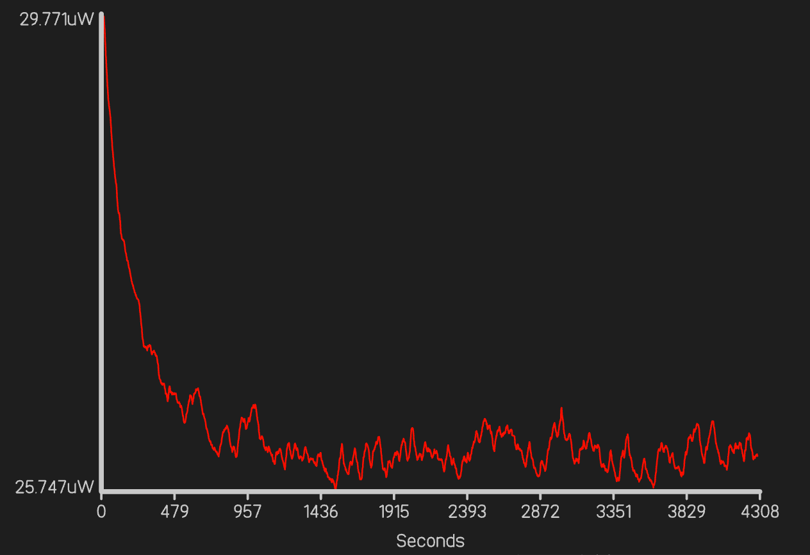

# Graph

Just a small project for a specific application, but I will use this as a default grapher application in future. It doesn't have the generality at the moment to do that but as I end up needing it more it will get more general features.

;