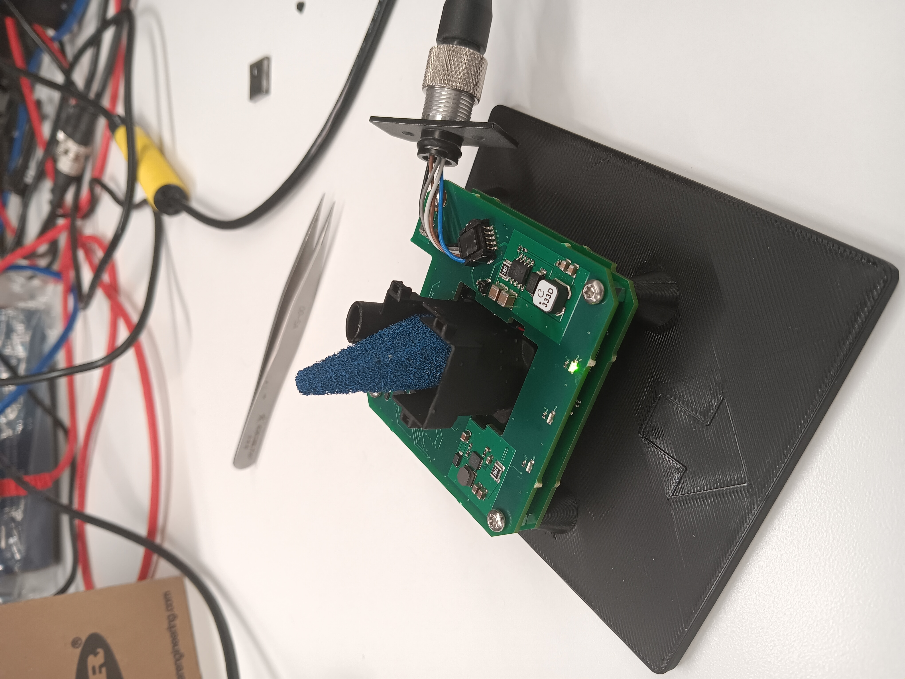

Calculated SiPM Breakdown: 3160

Tested at: 1550 (46.53V)

Tested: 9 apatures

Tested in three environments, images are included

Recorded data using:
```
> python sipmBreakdown.py sipmPrint.txt sipmLog.txt COM3 xml\MeasurementLidarPSSI_100_us_59235.xml 1600 1500 10
```

# Typical Conditions



| Apature    |    Ambient ADC    |
| ---------- | ----------------- |
| No Apature | 995.7324159021407 |
|     1      | 86.97247706422019 |
|     2      | 86.17125382262996 |
|     3      | 87.47553516819572 |
|     4      | 87.42201834862385 |
|     5      | 87.22137404580153 |
|     6      | 87.1697247706422  |
|     7      | 86.934250764526   |
|     8      | 87.08882082695253 |
|     9      | 86.83333333333333 |


# Under Tarp

| Apature    |    Ambient ADC    |
| ---------- | ----------------- |
| No Apature |  |
|     1      |  |
|     2      |  |
|     3      |  |
|     4      |  |
|     5      |  |
|     6      |  |
|     7      |  |
|     8      |  |
|     9      |  |

# In Light Box

| Apature    |    Ambient ADC    |
| ---------- | ----------------- |
| No Apature |  |
|     1      |  |
|     2      |  |
|     3      |  |
|     4      |  |
|     5      |  |
|     6      |  |
|     7      |  |
|     8      |  |
|     9      |  |